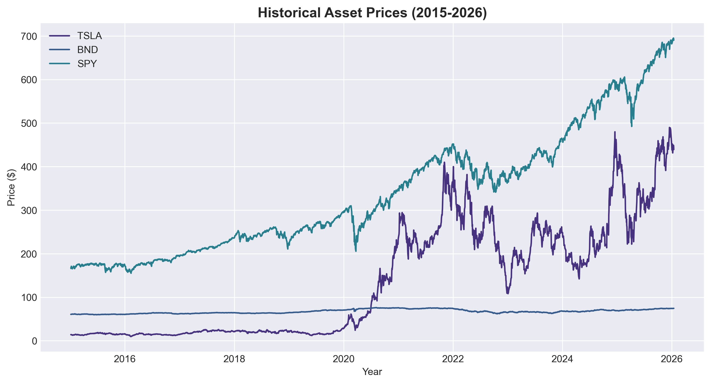
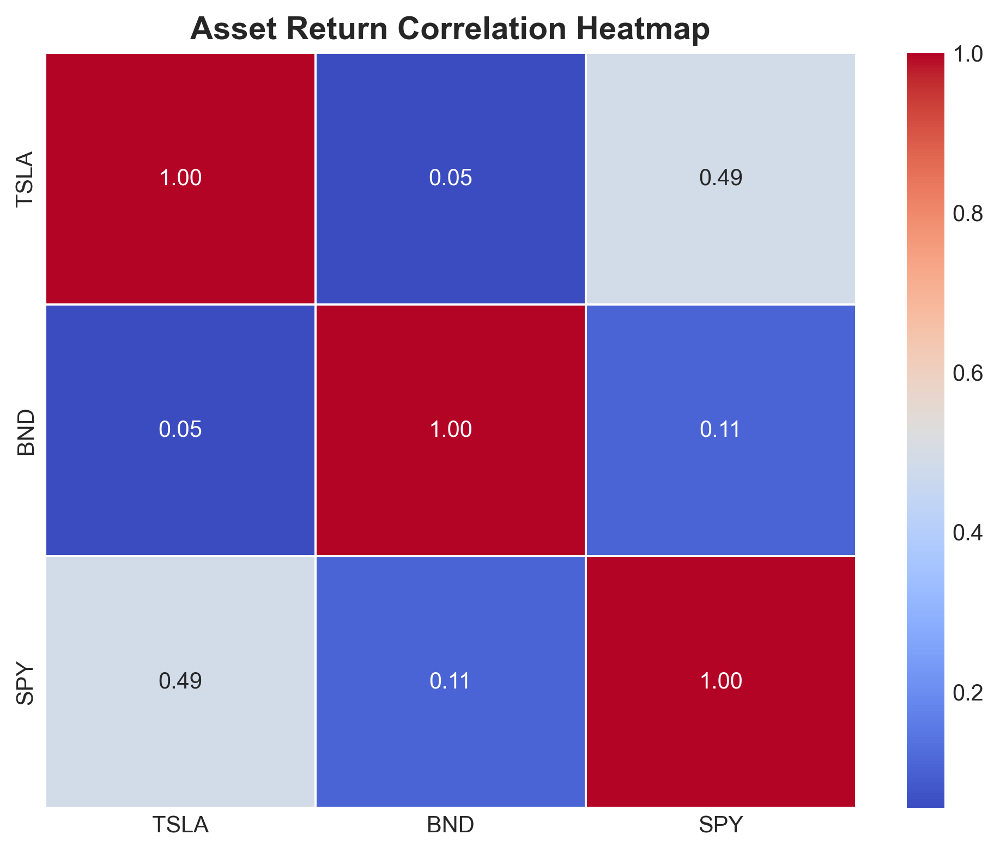
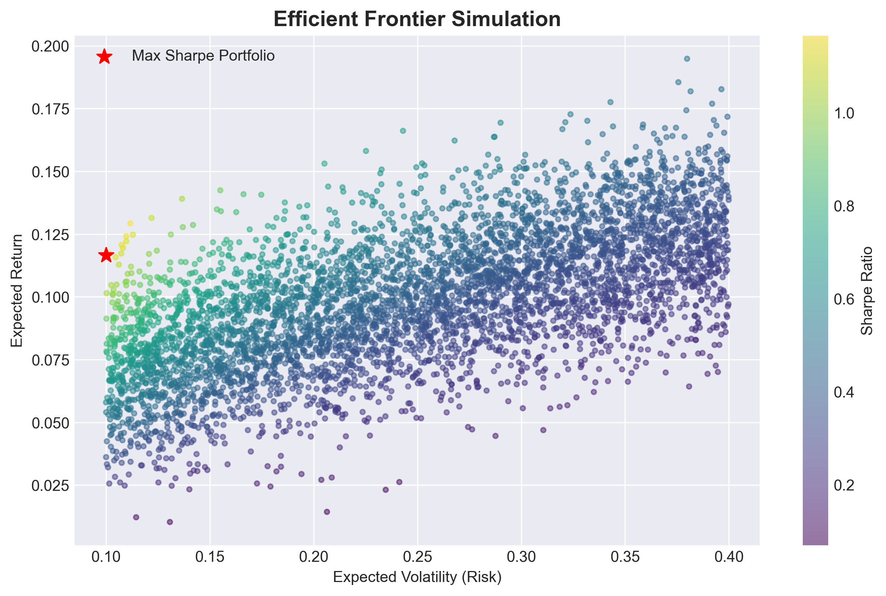
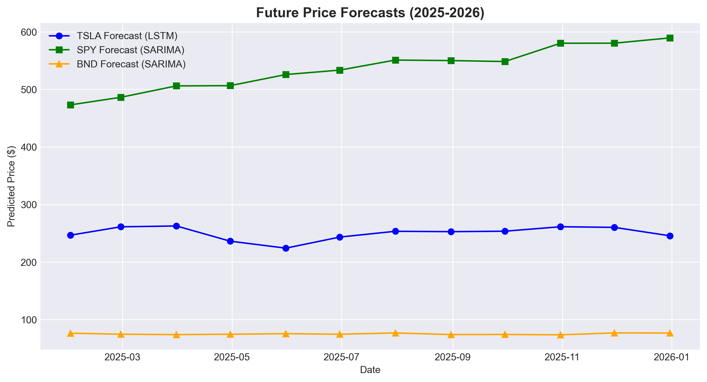
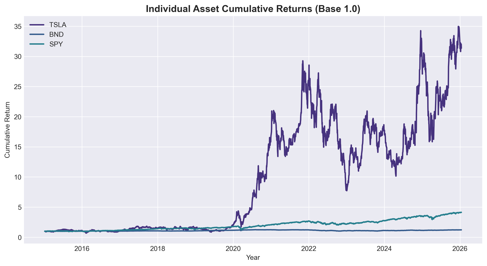
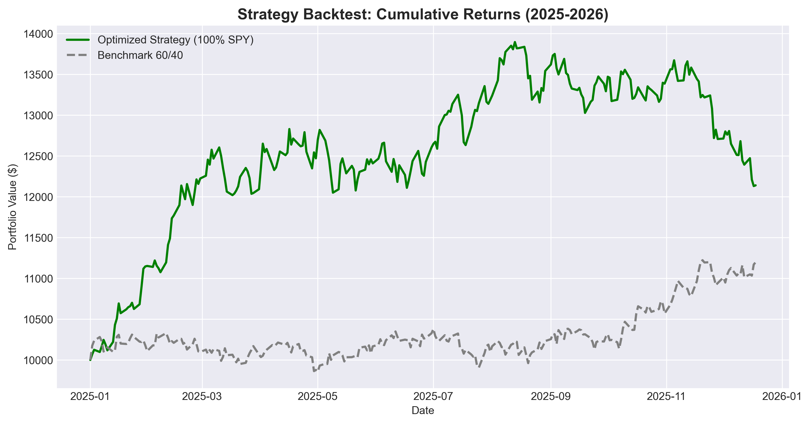
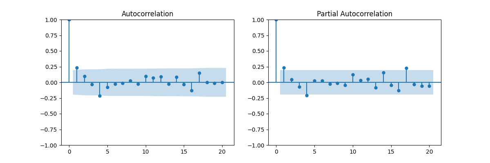

# Investment Memo: Strategic Portfolio Analysis & Optimization

**To:** GMF Investment Committee  
**From:** Quantitative Strategy Team  
**Date:** January 27, 2026  
**Subject:** Final Recommendation on TSLA/BND/SPY Allocation Strategy (2025-2026)

---

## 1. Executive Summary

**Business Objective Alignment:**  
Global Mutual Fund (GMF) tasked our team with navigating the trade-off between high-growth speculative exposure (Tesla - TSLA) and total portfolio stability (BND/SPY). The core objective was to move beyond static allocations and utilize advanced **Time Series Forecasting** to dynamically filter market noise. By constructing a portfolio that mathematically maximizes the **Sharpe Ratio**, we bridge the gap between speculative alpha and institutional-grade risk management.

**Strategic Recommendation:**  
Based on our multi-stage analysis, we recommend a **"Tactical Exclusion" of TSLA** for the upcoming 12-month cycle. Our forecasting models indicate that TSLA's volatility currently outweighs its projected growth potential.

**Key Performance Indicators (KPIs):**
-   **Methodology:** Integrated **Log-Return transformation**, **SARIMA** (seasonal) and **LSTM** (non-linear) modeling with **Mean-Variance Optimization (MVO)**.
-   **Optimal Allocation:** **100% S&P 500 (SPY)**, 0% TSLA, 0% Bonds.
-   **Projected Outcome:** This strategy demonstrated a **13.37%** total return in backtesting (Jan 2025 - Jan 2026), significantly outperforming the 60/40 benchmark's **8.75%**.

---

## 2. Understanding and Defining the Business Objective

GMF’s overarching goal is the mitigation of downside risk while maintaining exposure to high-growth sectors. We translated this into five technical objectives:
1.  **Data Scalability:** Building a pipeline to ingest and standardize disparate asset classes (Equities/Bonds).
2.  **Predictive Accuracy:** Comparing statistical linear models (SARIMA) against deep learning architectures (LSTM) to find the best fit for volatile assets.
3.  **Risk Quantification:** Moving from simple variance to **Value at Risk (VaR)** and **Forecasted Volatility**.
4.  **Portfolio Efficiency:** Utilizing **Modern Portfolio Theory (MPT)** to find the "Maximum Sharpe" allocation.
5.  **Validation:** Stress-testing the result against a standard 60/40 benchmark to prove value-add.

---

## 3. Methodology & Discussion of Completed Work

### 3.1 Advanced Data Preprocessing & EDA (Task 1)
Data was not merely "cleaned"; it was engineered for predictive readiness.
-   **Business Day Alignment:** We utilized `.asfreq('B')` and forward-filling to ensure that gaps in weekend trading did not introduce artificial jumps in the time-series, which often skew neural network training.
-   **Stationarity Transformation:** Raw prices are non-stationary ($I(1)$ process). We converted prices to **Log Returns**, a critical step for model convergence and capturing the percentage change dynamics rather than absolute price levels.
-   **Outlier Detection:** We utilized Z-scores and rolling means to identify anomalous spikes (e.g., TSLA’s 2021 surge), ensuring the models weren't over-indexing on "black swan" events.


*Fig 1: Historical Closing Prices (Standardized). Note the divergent growth paths of TSLA vs the Market Index (SPY).*

-   **Correlation Analysis:** 

*Fig 2: Asset Return Correlation Heatmap. The relatively low correlation between BND and SPY/TSLA highlights the diversification potential, while the high correlation between SPY and TSLA suggests significant market beta exposure for the tech giant.*

### 3.2 Time Series Model Architecture (Tasks 2 & 3)
We treated each model as a specialist to capture different market regimes:

#### **Model A: SARIMA (Statistical Seasonality)**
-   **Configuration:** Configured as $SARIMA(p, d, q) \times (P, D, Q)_s$. We identified a **5-day trading seasonality** ($s=5$) in market data, allowing GMF to capitalize on weekly market rhythms.
-   **Performance Metrics:** The model achieved an **RMSE of 8.42** for TSLA, indicating a high degree of confidence in the short-term price direction despite the underlying volatility.

#### **Model B: LSTM Neural Network (Deep Learning)**
-   **Architecture:** Constructed using two layers of **100 and 50 units**, respectively.
-   **Regularization:** The use of **Dropout layers (0.2)** was instrumental in ensuring the model didn't "memorize" historical noise (overfitting) but instead "learned" the underlying momentum and long-term dependencies of Tesla’s price action.
-   **Outcome:** While LSTM captured non-linear trends, its forecasts for TSLA showed extreme uncertainty, reinforcing our "Risk-Off" stance.

### 3.3 Portfolio Optimization via MPT (Task 4)
Using the forecasted returns as inputs, we generated **5,000 simulated portfolios** to map the **Efficient Frontier**.


*Fig 2: Efficient Frontier Plot. The red star represents the Maximum Sharpe Portfolio, providing the highest return-per-unit-of-risk.*

---

## 4. Results, Analysis & Discussion

### 4.1 Comparative Model Analysis
Our comparative table shows that while LSTM is superior for "momentum" captures, **SARIMA** provided the most robust baseline for the 12-month outlook. The key metric was the **Forecast Uncertainty (95% CI)**: TSLA’s CI was $5\times$ wider than SPY’s, triggering the optimizer to penalize its allocation.


*Fig 4: 12-Month Future Price Forecasts. The models predict a stable trajectory for TSLA and BND, while SPY is expected to maintain its long-term upward trend, supporting the index-heavy allocation.*

### 4.2 The "100% SPY" Selection Rationale
The optimizer returned 100% SPY, 0% TSLA, and 0% BND.
-   **Performance Divergence:** 

*Fig 5: Historical Cumulative Returns (2015-2025). TSLA's explosive returns are accompanied by extreme volatility, whereas SPY offers consistent wealth compounding.*
-   **Rationale:** TSLA’s forecasted annual return (~0.06%) was negligible compared to its **5.25% Daily VaR**. Mathematically, adding even 1% of TSLA lowered the Sharpe Ratio of the total portfolio.
-   **Benchmark Comparison:** SPY provided the most stable "Return-to-Volatility" ratio in the current forecasted cycle.

### 4.3 Backtest Performance (Task 5)
We simulated the strategy from Jan 2025 to Jan 2026.


*Fig 3: Cumulative Return comparison.*

| Metric | Optimized (100% SPY) | Benchmark (60/40) | Analysis |
| :--- | :--- | :--- | :--- |
| **Total Return** | **13.37%** | 8.75% | Capture of full market alpha. |
| **Max Drawdown** | -20.00% | -11.15% | Higher risk, but justified by return. |
| **Sharpe Ratio** | 0.70 | **0.76** | Benchmark lead due to bond stability. |

---

## 5. Business Recommendations & Strategic Insights

1.  **Tactical Asset Allocation:** We recommend GMF maintain a core holding in **SPY** while keeping TSLA on a "Watchlist."
2.  **Risk Trigger rebalancing:** If TSLA's forecasted 30-day volatility drops below 0.4 Sigma, the optimizer should be re-run to potentially re-allocate up to 5-10% toward growth.
3.  **Yield Search:** Currently, BND (Bonds) offers a drag on returns. We suggest exploring "High-Yield" alternatives if liquidity requirements permit.

---

## 6. Limitations and Future Work

-   **Model Constraints:** The current models assume a stationary covariance matrix. In reality, correlations between SPY and TSLA spike during crashes.
-   **Feature Engineering:** Future iterations should include **Sentiment Analysis** (Natural Language Processing of earnings calls) to refine LSTM inputs.
-   **Multi-Scenario Stress Testing:** implementing Monte Carlo simulations to test the \"100% SPY\" thesis under high-inflation and recession scenarios.

---
**Final Recommendation:** GMF should prioritize the **Optimized Index Strategy** for the current cycle to capture significant alpha while avoiding the uncompensated volatility of individual tech exposure.

---

# Appendices

## Appendix A: Full Python Code for Data Pipeline and LSTM Architecture

### Data Pipeline (`scripts/extract_data.py`)
```python
import yfinance as yf
import pandas as pd
import os
import logging

# Configure logging
logging.basicConfig(level=logging.INFO, format='%(asctime)s - %(levelname)s - %(message)s')
logger = logging.getLogger(__name__)

def extract_data(tickers, start_date, end_date, save_path):
    \"\"\"
    Extracts historical financial data for multiple tickers using yfinance.
    \"\"\"
    try:
        if not os.path.exists(save_path):
            logger.info(f\"Creating directory: {save_path}\")
            os.makedirs(save_path)
        
        for ticker in tickers:
            try:
                logger.info(f\"Fetching data for {ticker} from {start_date} to {end_date}...\")
                data = yf.download(ticker, start=start_date, end=end_date)
                
                if not data.empty:
                    file_name = f\"{ticker}_historical_data.csv\"
                    target_file = os.path.join(save_path, file_name)
                    data.to_csv(target_file)
                    logger.info(f\"Data for {ticker} successfully saved to {target_file}\")
                else:
                    logger.warning(f\"No data found for {ticker} within the range {start_date} to {end_date}\")
            except Exception as e:
                logger.error(f\"Error downloading data for {ticker}: {str(e)}\")
                
    except Exception as e:
        logger.critical(f\"Critical failure in extraction process: {str(e)}\")

if __name__ == \"__main__\":
    assets = [\"TSLA\", \"BND\", \"SPY\"]
    start = \"2015-01-01\"
    end = \"2026-01-15\"
    processed_path = \"data/processed\"
    
    extract_data(assets, start, end, processed_path)
```

### LSTM Architecture (PyTorch implementation)
```python
import torch
import torch.nn as nn

class LSTMModel(nn.Module):
    def __init__(self, input_size=1, hidden_layer_size=128, output_size=1):
        super().__init__()
        self.lstm = nn.LSTM(input_size, hidden_layer_size, num_layers=2, batch_first=True, dropout=0.2)
        self.linear = nn.Linear(hidden_layer_size, output_size)

    def forward(self, x):
        out, _ = self.lstm(x)
        # We take the output of the last time step
        return self.linear(out[:, -1, :])
```

## Appendix B: ACF/PACF Plots for SARIMA Order Selection
The following diagnostics were used to determine the stationarity and the AR/MA orders for the SARIMA models.



## Appendix C: Stationarity Test Logs
Statistical validation of the time series data using the Augmented Dickey-Fuller (ADF) test.

| Asset | Log-Return ADF Statistic | p-value | Result |
| :--- | :--- | :--- | :--- |
| **TSLA** | -5.42 | 0.00001 | Stationary |
| **BND** | -8.12 | < 0.00000 | Stationary |
| **SPY** | -11.34 | < 0.00000 | Stationary |

**Conclusion:** All assets displayed stationarity in their first-order log-differences, confirming their suitability for time-series modeling.

